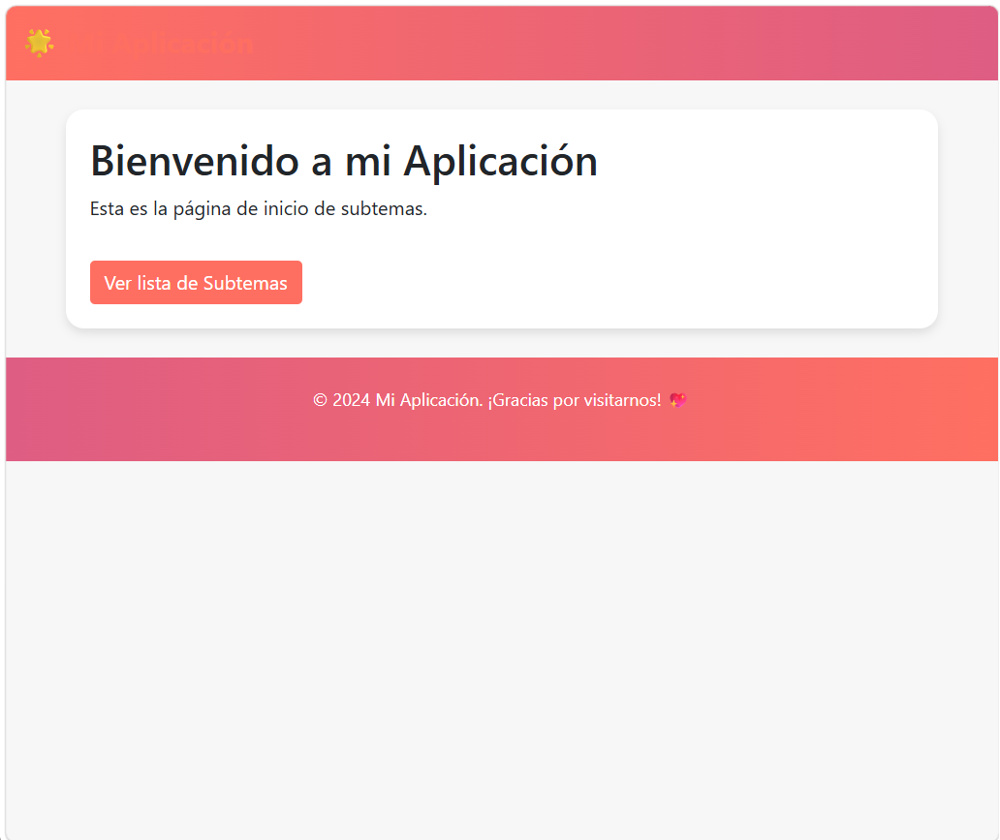
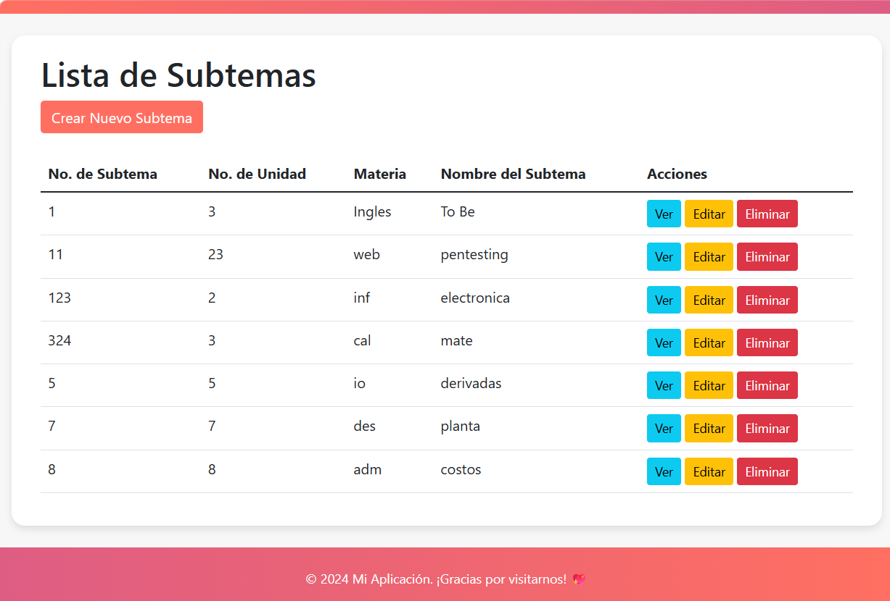

# Mi Aplicación - Gestión de Subtemas

¡Bienvenido a **Mi Aplicación**! Este es un sistema web integral desarrollado para la gestión, control y visualización de subtemas académicos correspondientes a diversas materias y unidades de estudio. El proyecto implementa un CRUD completo utilizando una arquitectura robusta y moderna.

---
##  Vista previa 

<div align="center"> 
 


##  Características Principales

Basado en las interfaces del sistema (`Captura de pantalla 2026-07-04 143314.png` y `Captura de pantalla 2026-07-04 144127.png`), la aplicación cuenta con las siguientes funcionalidades:

*   **Página de Inicio Personalizada:** Una interfaz de bienvenida limpia y amigable que introduce al usuario al ecosistema de la aplicación.
*   **Visualización de Datos:** Módulo central de "Lista de Subtemas" presentado en una tabla organizada con la información clave de cada registro.
*   **Operaciones CRUD Completas:**
    *   **Crear (Create):** Formulario para dar de alta un nuevo subtema mediante el botón `Crear Nuevo Subtema`.
    *   **Leer (Read):** Opción `Ver` para detallar de manera individual cada subtema guardado.
    *   **Actualizar (Update):** Opción `Editar` para modificar campos existentes de manera ágil.
    *   **Eliminar (Delete):** Opción `Eliminar` para dar de baja registros de la base de datos de manera definitiva.

---

##  Tecnologías Utilizadas

*   **Backend & Framework:** Laravel (PHP)
*   **Base de Datos:** MySQL / MariaDB (gestionado a través de **XAMPP**)
*   **Frontend:** Blade Templates estructurado con estilos responsivos y modernos (gama de colores coral/salmón).
*   **Servidor Local:** Apache (XAMPP Control Panel)

---

##  Estructura de Datos (Campos del Modelo)

Cada registro en el módulo de Subtemas almacena los siguientes campos visibles en la interfaz:
1.  **No. de Subtema:** Identificador o número específico asignado al subtema.
2.  **No. de Unidad:** Bloque temático o unidad a la que pertenece dentro del plan de estudios.
3.  **Materia:** Clave o nombre abreviado de la materia.
4.  **Nombre del Subtema:** Título descriptivo del tema académico tratado.

---

##  Requisitos e Instalación

Para desplegar y ejecutar este proyecto en tu entorno local, sigue detalladamente los pasos a continuación:

### Prerrequisitos
*   Tener instalado [XAMPP](https://www.apachefriends.org/) (con soporte para PHP compatible con tu versión de Laravel).
*   Tener instalado [Composer](https://getcomposer.org/).
*   Tener instalado [Git](https://git-scm.com/).

### Pasos para la Configuración Local

1.  **Clonar el repositorio:**
    ```bash
    git clone <URL_DE_TU_REPOSITORIO>
    cd <NOMBRE_DE_LA_CARPETA_DEL_PROYECTO>
    ```

2.  **Instalar dependencias de PHP:**
    ```bash
    composer install
    ```

3.  **Configurar las Variables de Entorno (`.env`):**
    Copia el archivo de ejemplo para generar tu entorno local:
    ```bash
    cp .env.example .env
    ```
    *Nota importante:* Recuerda incluir tu archivo `.env` en el `.gitignore` para mantener seguras tus credenciales locales ejecutando:
    ```bash
    echo ".env" >> .gitignore
    ```

4.  **Configurar la Base de Datos en XAMPP:**
    *   Abre el **XAMPP Control Panel** e inicia los servicios de **Apache** y **MySQL**.
    *   Accede a `http://localhost/phpmyadmin/` en tu navegador.
    *   Crea una nueva base de datos (por ejemplo, llamada `mi_aplicacion_db`).
    *   Abre tu archivo `.env` recién creado y configura las líneas de conexión de la siguiente manera:
        ```env
        DB_CONNECTION=mysql
        DB_HOST=127.0.0.1
        DB_PORT=3306
        DB_DATABASE=mi_aplicacion_db
        DB_USERNAME=root
        DB_PASSWORD=
        ```

5.  **Generar la clave de la aplicación:**
    ```bash
    php artisan key:generate
    ```

6.  **Ejecutar las Migraciones (Creación de tablas):**
    Envía la estructura de las tablas directamente a tu base de datos en XAMPP:
    ```bash
    php artisan migrate
    ```

7.  **Iniciar el Servidor de Desarrollo:**
    ```bash
    php artisan serve
    ```
    Una vez iniciado, abre tu navegador e ingresa a: `http://127.0.0.1:8000`

---


